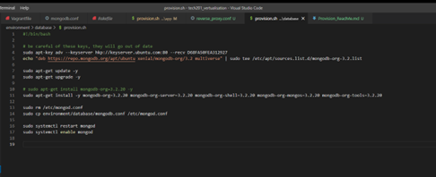
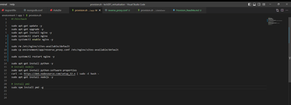
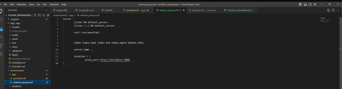
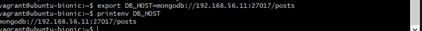
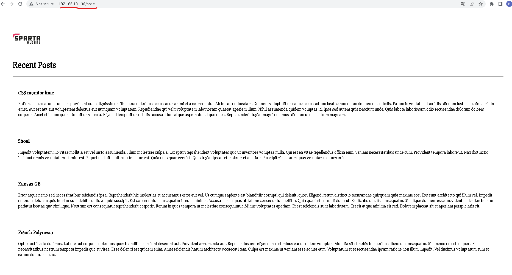

# how to set up provisions for database and app with a reverse proxy

# step 1
- Make sure to write down this code to be able to provsion your db to be installed automatically 

# step two 
- In your app provision make sure that you have this code wirtten down with the extra code for the revrese proxy whihc is `sudo rm /etc/nginx/sites-available/default
sudo cp environment/app/reverse_proxy.conf /etc/nginx/sites-available/default`

# step 3
set up the reverse proxy 
as a new file 

# step four run vagrant up 
- once this is complete gop into git and export you db with the code

# step 5
- cd into your app folder twice and then run npm install and then node app.js and you should only have to type the ip adress/posts to get this site working 
