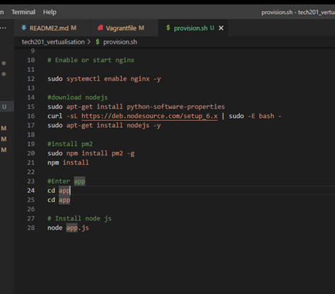

- Kernal core of the OS how the machine actually does what we need it to do. 
- log in security making sure we know who yoiu are
### user mode
- shell (command line) use comands to talk to the OS
- uname shows system information gives the name of the kernal
## gui
- flag gets put after a command to make it do more specific stuff 
- `-a` gives all the information aboutn the OS
- `-s` just goves the kernal name 
- `-r` stands for version and gives us the version of the kernal 
- `-m` is the hardware name 
- `-i` hardware platforme 
 


cd ../../ move you up to levles in your folder 
cd / takes you back to the root directory
cd ~ does the same as cd / however this will take you to your home directory 

## absolute path
### linux/mac
 user/username/Documents/myfile.txt

### windows
c:\users\username\Documents\myfile.txt

### web urls
https://www.mysite.com/myfolder/subfolder/sub/sub2/page.html

## relative path
/Folder/Folder2/file.txt


`touch (makes a empty file) emptyfile.txt`

`nano` makes a file that you can edit

`cat myfile.txt` this gives back whast in the file

`mkdir` (make directory) this creates a folder 

`-r` stands for recurssive this means copy everything 

`rsync -r` new_folder new_folder2 second one wants to sink up with the first

`mv` is how you move files need to specify file first then write then folder you want to put it into (best practice is to put a / after the folder name)

`mv myfile.txt ../` moves the file two folders along 

`mv myfile.txt myfilerename.txt` this will rename the original file 

`rm` removes things (there is no check it will just remove it)

to delete a folder is `rm -rf` do delete everything inside of it. 

man ls 
```
LS(1)                                               User Commands                                               LS(1)

NAME
       ls - list directory contents

SYNOPSIS
       ls [OPTION]... [FILE]...

DESCRIPTION
       List  information  about the FILEs (the current directory by default).  Sort entries alphabetically if none of
       -cftuvSUX nor --sort is specified.

       Mandatory arguments to long options are mandatory for short options too.

       -a, --all
              do not ignore entries starting with .

       -A, --almost-all
              do not list implied . and ..

       --author
              with -l, print the author of each file

 Manual page ls(1) line 1 (press h for help or q to quit)

```
grep is how we search things. grep test will find the word test in a file if it does exist. * measn were does this thing come up in the whjole folder 

### wild card


## Persmision with ls -l

`r`- stands for read (they can read the file)

`w`- write (allows us to change the contents of the file)

`x`- execute (they can execute and run the file)  

Owner (of the file)- Group(who have acces) - Other/all 

`chmod` change file (ch) mode bits (mod). changes permission of who can use the file.

u  = user/owner 
g = group 
o = owner

user - group - other

                read    write   execute
setting:          0        0       0
binary value:     4        2       1 

4 + 2 + 1 = 7
777 -> all permissions for all user/group/other

755 -> user can do everything group and other can read and execute. 

`top` is a task manager 

`kill -9 process number` will kill a really stuborn process 

the & runs your process in the back ground and stops your process from locking you out until it is completed 

`ctrl z` stops the process 

`fg` restarts the process foreground

`tree 
# How to get app up and running 
- First you will need to cd into envirnemt twice as it is nested 
- then cd into spec-test
- run `gum bundler`
- after this run `bundle`
- then run rake spec to check what you need to install into your environment 
- once in your virutal machine use the comand apt-get update -y
- once this is complet run sudo apt-get upgrade -y (dont us ethis command on a production environment)
- once this has run you will need to install nginx use `sudo apt-get install nginx  
-  then run sudo systemctl enable nginx to enable nginx 
- then copy your ip adress into a web browser adn you should get nginx load up
- after this you will need to install nodejs in order to get your app working.
- to do this first use `sudo apt-get install python-software-properties`
- the you need to `curl -sL https://deb.nodesource.com/setup_6.x | sudo -E bash -`
- then use `sudo apt-get install nodejs -y` to install nodejs
- to install the pm2 `sudo npm install pm2 -g` 
- use node app.js
- this will run your app is ready and listening on port 3000
- you then just need to add `:3000` the end of the ip adress to run the app ion the web browser. 

# How to acces the app through provision

- First you need perform vagrant destroy to destroy your vm which will then allow you to vagran up with all the new code written.
- to know what apps you need to isntall you can see this through `rake spec`
- second then need to add in all the apps that need to be isntalled 



In this screen shot you can see all the installs that are needed to make the app work.

you will also need this line of code in your vagrant file to get the provision file working with your vagrant file `config.vm.provision "shell", path: "provision.sh"`
once you have got all this down you will be ablke to use `vagrant up` comand again and it should run your vm withought you having to manually install everything one by one.

# Nginx reverse proxy

- A port is a virtual point where network connections start and end
- A traditional forward proxy server allows multiple clients to route traffic to an external network. For instance, a business may have a proxy that routes and filters employee traffic to the public Internet. A reverse proxy, on the other hand, routes traffic on behalf of multiple servers.

- Through a simple command you can verify the status of the Nginx configuration file: `sudo nano /etc/nginx/sites-available/default` The output will show if the configuration file is correct or, if it is not, it will show the file and the line where the problem is

### How to create a reverse proxy 
- use sudo nano /etc/nginx/sites-available/default to be able to 
- `location / {
        proxy_pass http://localhost:8080;
        proxy_http_version 1.1;
        proxy_set_header Upgrade $http_upgrade;
        proxy_set_header Connection 'upgrade';
        proxy_set_header Host $host;
        proxy_cache_bypass $http_upgrade;
    }
}`
add this to and chnage where it says 8000 to what ever port your computer is listening on 
- then run sudo nginx -t
- finally use sudo systemctl restart nginx
- the you should just be able to run the ip adress without adding the port number on the end 

# How to work with two data bases 

to get multi machines working make sure that you have this code down.
- then vagrant up and you should be getting botyh app and data base running 
- one in the data base ssh start getting mongodb you need to first get the key `udo apt-key adv --keyserver hkp://keyserver.ubuntu.com:80 --recv D68FA50FEA312927  # A confirmation of import will be displayed`
- the  you need to use sudo apt-get update -y 
- one this is done then sudo apt-get upgrade -y
- then install the mongodb database with `sudo apt-get install -y mongodb-org=3.2.20 mongodb-org-server=3.2.20 mongodb-org-shell=3.2.20 mongodb-org-mongos=3.2.20 mongodb-org-tools=3.2.20`
- once this is done you will need to use `sudo systemctl start mongod`
- then you need to `sudo systemctl status mongod`
- then finally `sudo systemctl enable mongod`
- iog this has worked ytou should see `Created symlink /etc/systemd/system/multi-user.target.wants/mongod.service -> /lib/systemd/system/mongod.service.` in the terminal

- normal variable 
`MY_VAR=hello` to make a variable in linx (use upper case to make the readable)


### after this is installed move over to app 

- start by ruinning this code `sudo nano /etc/mongod.conf` 
- within this file you will need to find `net:
 port: 27017
 bindIp: 127.0.0.1`
 and change the bindip to `0.0.0.0`

 - then you will to reset mongodb with `sudo systemctl restart mongod`
 - and then finally enable mongodb with `sudo systemctl enable mongod`
 - after this you will need to set up an envireonment variable to do this start by inputing `export DB_HOST=mongodb://192.168.10.150:27017/posts`
 - then you will need to `printenv DB_HOST` to make sur eit is working 
 - then the last stage you will wite `npm install` one this is done wirte `node app.js` 
 - then you will write in your browser 192.168.56.10:3000/posts to get pposts working. 


